  

## 📊 GitHub Stats & Trophies

  
  

  

  

  

## 🛠️ Languages & Tools

> ## Programming Languages

 

> ## Frontend

    

> ## Backend

 

> ## Database

    

> ## DevOps & Cloud

 

> ## Tools

    

  

## 🔗 Connect with Me

 

  

